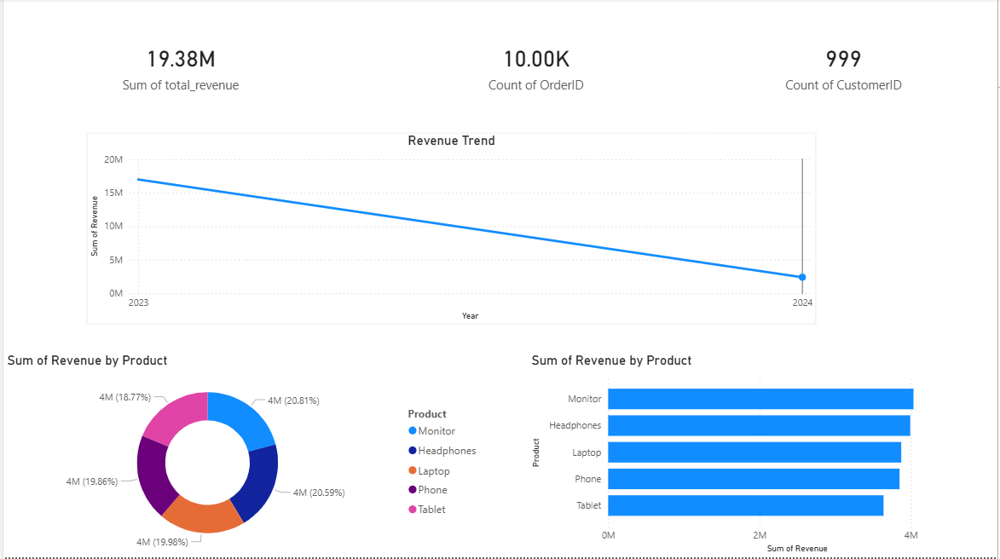

# Retail Sales Analytics Dashboard

This project analyzes retail sales data to identify product performance, customer behavior, and revenue trends.

## Tools Used

- SQL
- Python
- Power BI

## Project Workflow

Python → MySQL → SQL Analysis → Power BI Dashboard

## Key Insights

• Top products contribute the majority of revenue  
• Sales trends reveal seasonal patterns  
• Customer purchase behavior shows revenue concentration among top buyers

## Dashboard Preview

